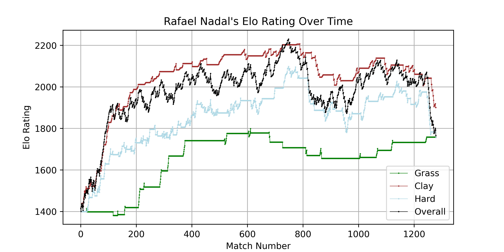
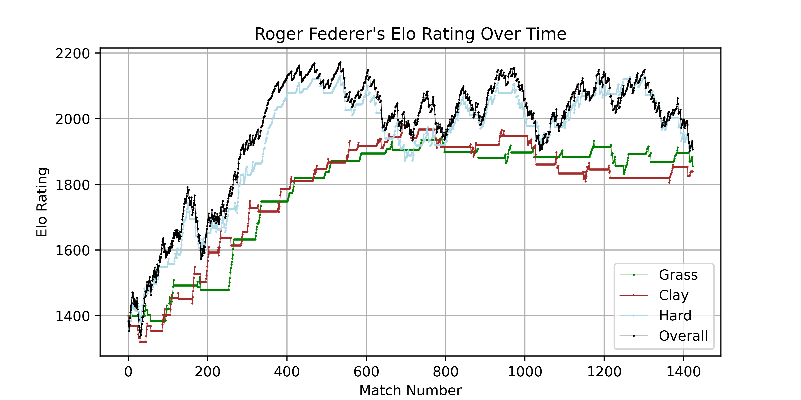

# Tennis Prediction

Predicting ATP match outcomes using 25 years of historical data. The project covers factor engineering, ML model training, and a betting market analysis that compares model predictions against bookmaker-implied probabilities.

---

## Notebooks

| Notebook | Description |
|---|---|
| `trytennisagain.ipynb` | Feature engineering, model training, and evaluation |
| `betting_market_analysis.ipynb` | Market comparison, Kelly betting simulation, and self-critique |

---

## What's in each notebook

### `trytennisagain.ipynb`

**Data:** 25 years of ATP match data (2000–2024) from the [Jeff Sackmann dataset](https://github.com/JeffSackmann/tennis_atp), cleaned and filtered for matches with complete serve statistics.

**Features engineered:**
- Elo ratings — overall and per surface (hard, clay, grass)
- Elo gradient — slope of Elo trajectory over last N matches
- Rolling win rates — last 3, 5, 10, 25, 50, 100 matches
- Serve statistics — ace rate, double fault rate, 1st serve %, break points saved (rolling)
- H2H record — overall and per surface
- ATP ranking and ranking points differential
- Age and height differential

**Models trained:** Logistic Regression, Neural Network (MLP), SVM, XGBoost, Gaussian Naive Bayes

**Test set:** 2025 Australian Open (116 matches, held out entirely from training)

---

### Elo ratings

Elo tracks a player's true strength over time — it updates after every match based on the result and the opponent's rating. A win against a stronger opponent moves your rating more than a win against a weaker one.

We compute separate Elo ratings per surface, which captures something ATP rankings miss: a player can be dominant on clay but average on grass.

**Rafael Nadal** — clay Elo consistently above overall, confirming surface dominance. Grass Elo significantly lower and step-like due to fewer matches.

**Roger Federer** — hard court Elo tracks almost identically with overall, reflecting where he played most of his best tennis. Clay notably weaker relative to his overall rating.

---

### `betting_market_analysis.ipynb`

Takes the trained models and evaluates them against the bookmaker as an efficient market benchmark.

**Method:**
1. Merge betting odds onto the Aus Open test set via player ranking pairs
2. Strip bookmaker vig (~4.9%) to recover true implied probabilities
3. Compare model accuracy, ROC-AUC, and Brier score against the market baseline
4. Simulate fractional Kelly betting strategies — bet only when model edge exceeds 5%
5. Stress-test results against look-ahead bias, overfitting, sample size, and generalisation

---

## Project structure
